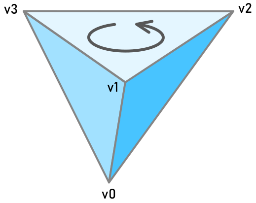
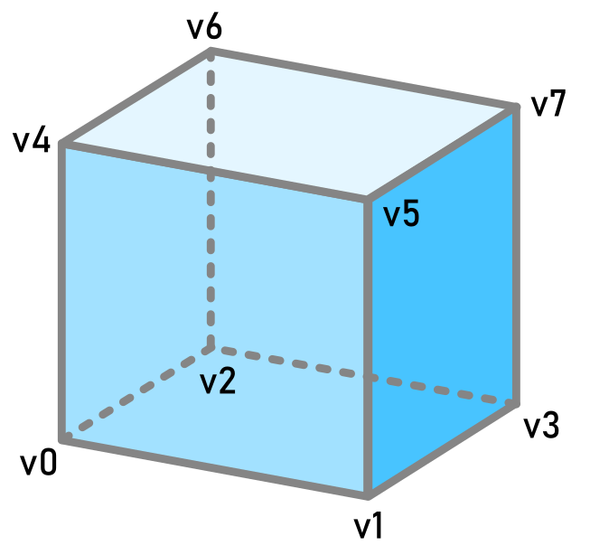

# 4DO-Specification
The official specification for the 4DO Geometry File Format

# 4D OBJ File Format Specification - Version 2
August 2, 2024

## Background
In recent years, four-dimensional software and video games have seen a steady rise in popularity and interest. Games like Miegakure, 4D Miner, 4D Golf, and 4D Toys all have growing fan bases and some have seen viral success with their devlogs and status updates. Other software such as Stella4D, Polychora, and HoxelDraw are geared toward 4D content creation and visualization. So far, there seems to be little or no collaboration or coordination between any 4D software. As of April 2024, there is no consensus on a standard file format for 4D geometric objects. Some software (at least Stella4D and Polychora) have used a modified version of the .OFF file format, originally designed for 3D polytopes. However, the extensions to 4D seem out-of-place within the file format. Additionally, the geometric structure of the .OFF format (arbitrary cells composed of arbitrary polygons) requires too much post-processing to transform the data into a tetrahedral mesh. Other software uses either a proprietary format, or opts to generate geometric models on-the-fly.

I propose a new 4D geometry file format that is designed specifically for 4D computer graphics applications.

### Design Goals
- Enable 4D geometric data transfer between 4D applications
- Use the most basic, common building blocks of 4D computer graphics ("least common denominator")
- Human readable
- Contain mostly primary data, very little metadata, and no secondary data (i.e. data that can be generated from primary data)
- Describe only geometry, not a full scene
- Minimize data duplication

This format might not be the most efficient, nor the most flexible. It does not cover all possible use-cases of 4D geometric computation. This format is intended to be simple to read and write, both by humans and computers. Its features are unapologetically skewed toward those needed for 4D Animation and 4D Game applications.

### Core Features
- Vertices
  - Position
  - Normal
  - Texture coordinate
  - Color
- Polylines
- Tetrahedral cells
- Cuboid cells
- Compound cells (contiguous groups of primitive cells)
- Model Orientation

### Format Design Inspiration: Wavefront OBJ
The 4DO format is mostly patterned after the ubiquitous Wavefront OBJ file format for 3D geometry. The OBJ format is popular for its human readability, simplicity, and its ability to reuse vertex data for multiple faces. The 4DO format will feel very similar to the OBJ format with a few key differences:

1. It's 4D instead of 3D (obviously)
2. It supports a small, hard-coded list of primitive cells whereas OBJ supports n-sided convex and concave polygons
3. The indices are Zero-based, as opposed to OBJ which is One-based
4. Relative indices are NOT supported in 4DO (no negative indices)
5. 4DO provides a mechanism for defining the coordinate frame of the model
6. It supports vertex colors in addition to texture coordinates
7. 4DO doesn't support multiple objects

## About this document
**OPTIONAL**, **REQUIRED**, **MAY**, **MAY NOT**, **SHOULD**, **SHOULD NOT**, **MUST**, **MUST NOT**

**OPTIONAL**: The inclusion and/or exclusion of valid **OPTIONAL** elements does not affect the validity of the file.

**REQUIRED**: If a given file does not include a required element or does not satisfy a required specification, it is Invalid. The application is not expected to process such a file and can reject it. When possible, the reason for rejection should be given.

**MAY**/**MAY NOT**: The practice and/or convention is allowed, but not required.

**SHOULD**/**SHOULD NOT**: Denotes a convention or best practice, but is not strictly required for a valid 4DO file.

**MUST**/**MUST NOT**: Failure to follow the convention or practice will render the file Invalid.

## File Structure

### File Header
A 4DO file **MUST** begin with "4DO" followed by a space and then the file specification version, which is currently "2", like this: `4DO 2`. The `4DO` command **MUST** be provided before any other commands.

If an Orientation is provided, it **SHOULD** be provided in the header lines and it **MUST** be provided before any Vertex data is listed.

### Commands

A 4DO file is made up of Commands. A Command resides on a single line and is composed of one keyword followed by relevant data.

Commands are processed sequentially. A Command **MUST NOT** reference data that is further down the file.

Keywords are case-insensitive.

Blank lines are ignored.

### Floating Point Numbers
Floating point numbers can have arbitrary precision. Use the period instead of the comma to denote fractional values. Floating point numbers **MUST** be real numbers. Negative numbers **MUST** use the `-` sign. Positive numbers **MAY** use the `+` sign but any number without a sign is assumed to be positive.

Floating point numbers **MAY** be written as integers, without a decimal point (e.g. `1`)

Floating point numbers **MAY** be expressed in scientific notation.

`+/-Infinity` and `NaN` are not valid floating point numbers.

### Indices
Indices are zero-based (as opposed to Wavefront OBJ where indices are 1-based)

Indices **MUST** be non-negative real integers and **MUST NOT** refer to out-of-bounds data positions (i.e. if there are 10 vertices defined, a Tetrahedron **MUST NOT** attempt to refer to a vertex at index 10 (which would be the 11th vertex))

### General
4DO parsers **SHOULD** support Unicode characters and **SHOULD** expect .4DO files to be encoded using UTF-8.

## Invalid 4DO Files

If a file is deemed **INVALID**, it **MAY** be rejected outright. However, a parser **MAY** attempt to fix the contents of the file, but it's under no obligation to do so. Optionally, it may disregard the broken/inconsistent data and attempt to properly load the rest of the data. If this is done, a parser **SHOULD** inform the user of the problem and of which data wasn't loaded.

## Geometric Structure
There are several ways to define 4D geometric entities. Vertices and vertex data are the foundation of this file format. All other structures build upon collections of vertex data (or collections of collections of vertex data).

### Vertex => Tetrahedron
Tetrahedra are one of the main primitive cells of 4DO. A tetrahedral mesh will likely be the most common usage for 4D graphics.


### Vertex => Cuboid
Cuboids are another useful primitive cell for 4D meshes. They can easily be decomposed into tetrahedra for applications that require it.

TODO: vertex -> cuboid diagram

### Vertex => Primitive Cell => Cell Group
For more advanced rendering or modeling systems, an application may require the use of higher-order cells, rather than just tetrahedra. While 4DO doesn't directly support arbitrary cell configurations, it can effectively support them by the use of the Cell structure, which is a grouping of tetrahedra into a higher-order polyhedron.


### Vertex => Polyline
Some 4D applications developers may want to render some edges of the geometry, but not all of them. Polylines should be used for this.


### Vertex
Using only vertex data, 4DO can encode 4D point cloud data. This may also have utility with applications that use 3D+time.


## Comments

Comments are denoted with the `#` symbol. Any text after a `#` **MUST** be ignored until a newline is encountered. Comments **MUST NOT** affect the geometric content of the file.

Comments **MAY** be placed on the same line as a Command, only **after** the full command is listed.

#### Examples
```
# This is a comment

v 1.0 2.0 3.0 4.0   # comments can also come after commands
```


## Model Orientation

An Orientation is **OPTIONAL**. If one is not provided, the orientation is assumed to be X-right, Y-up, Z-forward, W-over.

If an Orientation is provided, it **MUST** be listed only once and before any Vertex Positions are listed.

Model Orientation is defined using the `orient` command, followed by a space-separated list of signed axes that correspond to the Right, Up, Forward, and Over directions. Each of the X, Y, Z, and W axes **MUST** be included exactly once.

The Orientation should be used to orient only Vertex Position and Vertex Normal, but should not affect Vertex Texture Coordinate.

#### Examples
```
# default orientation
orient X Y Z W
```
```
# alternate orientation (-Y right, +W up, +X forward, -Z over)
orient -Y W X -Z
```

## Vertex Position
Vertex Positions are **REQUIRED**.

Each vertex **MUST** be defined on its own line.

A vertex is denoted using the `v` keyword, followed by 4 floating point numbers, denoting the x, y, z, w coordinates. Coordinate values are separated by spaces.

#### Example
```
v 1.0 1.0 -1.0 -1.0
```

## Vertex Normal
Vertex Normals are **OPTIONAL**.

A Vertex Normal is denoted using the `vn` keyword, followed by 4 floating point numbers, denoting the x, y, z, w components of the normal vector.

Vertex Normals **SHOULD** be normalized.

#### Examples
```
vn 0.5 0.5 0.5 0.5

# this normal vector is not normalized, but not invalid
vn 1.0 1.1 1.2 1.3
```

## Vertex Texture Coordinate

Vertex Texture Coordinates are **OPTIONAL**.

A Vertex Texture Coordinate is denoted using the `vt` keyword, followed by 3 floating point numbers, denoting the u, v, w components of the texture coordinate.

Texture Coordinate values **SHOULD** be in the range [0,1]. Values **MAY** be outside the [0,1] range, but it is up to the application to decide how to handle values outside this range.

#### Examples
```
vt 0.25 0.75 0.1

# values outside [0,1] are also allowed
vt -0.2 1.6 0.9
```

## Color Data

Color Data is **OPTIONAL**.

Color Data can be assigned to Vertices, Tetrahedra, Polylines, and Cells in the same way that custom Data can be assigned to them.

A Color is denoted using the `co` keyword, followed by 3 or 4 unsigned integer numbers. These numbers **MUST** be in the [0,255] range. The 4 values represent the red, green, blue, and alpha components of the color. If only 3 values are provided, they are assumed to be the RGB components of the color and the Alpha component **SHOULD** be assumed to be `255`.

Colors can also be defined as 3-byte (RGB) or 4-byte (RGBA) hexadecimal numbers, like this: `co 0xRRGGBBAA`.

#### Examples
```
# RGB color
co 114 255 66
co 0x72FF42   # the same color in hex

# RGBA color
co 126 127 128 255
co 0x7e7F80FF   # the same color in hex
```

## Tetrahedron

Tetrahedra are **OPTIONAL**. The Tetrahedron is one of the primitive cells supported by 4DO.

A tetrahedron is denoted using the `t` keyword. A Tetrahedron command is an ordered list of vertex data for each of the four vertices of the tetrahedron. By default, tetrahedra are defined as a list of four Vertex Position indices, separated by spaces. Other data, such as Vertex Texture Coordinate, Vertex Normal, and Vertex Color, may be associated with a tetrahedron's vertices by customizing the [Cell Format](#primitive-cell-format-customization).

#### Examples
```
# Tetrahedron with only Vertex Position
# Note that a cellformat command is not required for this simple case
t 0 1 2 3
```
```
# Tetrahedron with Vertex Position (indices 0,1,2,3) and Vertex Normal (indices 4,5,6,7)
cellformat v/vn
t 0/4 1/5 2/6 3/7
```
```
# Tetrahedron with Vertex Position (indices 0,1,2,3), Normal (indices 4,5,6,7), and Texture Coordinates (indices 8,9,10,11)
cellformat v/vn/vt
t 0/4/8 1/5/9 2/6/10 3/7/11
```
```
# Tetrahedron with Vertex Position (indices 0,1,2,3), Texture Coordinates (indices 4,5,6,7), and Color (indices 8,9,10,11)
cellformat v/vt/co
t 0/4/8 1/5/9 2/6/10 3/7/11
```
```
# Two tetrahedra in the same file with their vertex position data listed just before the tetrahedron commands
# (the cellformat command is not necessary in this case since only vertex position data is provided)
v 0.0 0.0 0.0 0.0
v 1.0 0.0 0.0 0.0
v 0.0 1.0 0.0 0.0
v 0.0 0.0 1.0 0.0
t 0 1 2 3
v 2.0 2.0 2.0 2.0
v 4.0 2.0 2.0 2.0
v 2.0 4.0 2.0 2.0
v 2.0 2.0 4.0 2.0
t 4 5 6 7
```
```
# A tetrahedron with a single color (at index 9), rather than a color for each vertex
cellformat co v
t 9 0 1 2 3
```
```
# It's possible to define a tetrahedron format with multiple per-tetrahedron data points
cellformat co vt v/vn

# a tetrahedron with one color and one texture coordinate assigned (indices 5 and 7, respectively) as well as vertex position (indices 0,1,2,3) and vertex normal (indices 8,9,10,11)
t 5 7 0/8 1/9 2/10 3/11
```

### Tetrahedron Vertex Winding Order
The winding order of the vertices in a Tetrahedron helps to determine the direction of the surcell normal. While this order is not enforced by this specification, the following convention is recommended. With vertex 0 at the apex of the tetrahedron, the three vertices of the base of the tetrahedron should be listed in CCW order, when facing the front of the base. The vertex order is illustrated here:


## Cuboid
Like the Tetrahedron, the Cuboid is another primitive cell type supported by 4DO. Cuboids are **OPTIONAL**.

A Cuboid is any six-sided polyhedron where each face is quadrilateral and each of the eight vertices is shared by exactly three faces (e.g. cube, rectangular prism, parallelpiped, frustum, etc.).

A cuboid is denoted using the `c` keyword. A Cuboid command is an ordered list of vertex data for each of the eight vertices of the cuboid. By default, cuboids are defined as a list of eight Vertex Position indices, separated by spaces. Other data, such as Vertex Texture Coordinate, Vertex Normal, and Vertex Color, may be associated with a cuboid's vertices by customizing the [Cell Format](#primitive-cell-format-customization).

#### Examples
```
# Cuboid with only Vertex Position
# Note that a cellformat command is not required for this simple case
c 0 1 2 3 4 5 6 7
```
```
# Cuboid with Vertex Position (indices 0,1,2,3,4,5,6,7) and Vertex Normal (indices 8,9,10,11,12,13,14,15)
cellformat v/vn
c 0/8 1/9 2/10 3/11 4/12 5/13 6/14 7/15
```
```
# See the other examples provided for Tetrahedra since they also apply for Cuboids
```

### Cuboid Vertex Order
The order in which the vertices of the cuboid are provided is important, more so than for the Tetrahedron. There are many possibilities for vertex ordering, so a convention must be required to ensure consistent results from one application to the next.

Cuboid vertices MUST be provided in Z-Order (AKA Morton Order, Z-Curve-Order, or Binary Order (see [https://en.wikipedia.org/wiki/Z-order_curve](https://en.wikipedia.org/wiki/Z-order_curve))). Note that the ordering is relative to the cuboid's own reference frame; the world-space directions of the cuboid's edges are not important. The following diagram illustrates the vertex ordering convention:


### General Primitive Cell Requirements

Every cell **MUST** include Vertex Position data.

The indices provided by each cell entry **MUST** be non-negative integers. They also **MUST** correspond to vertex entries that have previously been listed in the file.

Vertex commands and Cell (Tetrahedron or Cuboid) commands **MAY** be mixed. You do not need to list all vertex data strictly before any cell commands. For example, you may list the vertex positions for a cell, then list the cell itself, then list more vertex positions for the next cell.

You **MAY** define a custom Cell Format that includes both vertex color data and texture coordinates, but it's up to the application to decide what to do if both are present.

Each vertex in a single cell **MUST** have the same format. (E.g. you couldn't do `t 1 2/4 5/6/8 6//6` because each of these four vertices uses a different format. Likewise, you couldn't do `c 1 2 3 4 5 6 7 8/9/10` because the format of the eighth vertex doesn't match that of the first seven)

## Primitive Cell Format Customization
Before listing any Tetrahedron or Cuboid commands, you must specify the line format (with one exception). The line format command tells the parser what data types are listed for each vertex in the cell and in what order.

The command keyword is `cellformat`, followed by a forward slash-separated list of vertex data keywords that will be included for each vertex. For example, to attach Vertex Texture Coordinate data to the each vertex of the cell, first call the following command: `cellformat v/vt`. Then, a tetrahedron may be listed like this: `t v0/vt0 v1/vt1 v2/vt2 v3/vt3` and a cuboid may be listed like this: `c v0/vt0 v1/vt1 ... v7/vt7`. Each vertex is a list of the vertex data indices in the order defined by the most first `cellformat` command, separated by `/`.
The default Primitive Cell Format is one that includes only Vertex Position data. You may list the command `cellformat v`, which has the same effect.

A Cell format **MUST** be defined before any primitive cells are listed (except when using only Vertex Position). Once a format has been defined, it **MUST NOT** be changed during the remainder of the file (i.e. only one cell format per 4DO file).

```
# Examples of cellformat are scattered throughout this document 
```

### Cell-level Data

You may also attach data to an entire primitive cell, as opposed to attaching to the individual vertices. For example, you may want to assign a color to the whole tetrahedron or cuboid, instead of assigning different colors to each vertex. To do this, call the `cellformat` command and list the keyword for the cell-level data first, followed by a space. For example, to attach color data to a cell (as well as vertex position and normal data), call `cellformat co v/vn`. Then, to list a tetrahedron, call `t co0 v0/vn0 v1/vn1 v2/vn2 v3/vn3`. Likewise, to list a cuboid, call `c co0 v0/vn0 v1/vn1 ... v7/vn7`.

## Polylines

Polylines are **OPTIONAL**.

Polylines are lists of vertex indices. A polyline is denoted using the `pl` keyword, followed by an ordered list of 2 or more Vertex Position indices, separated by spaces.

Additional data **MAY** be added to the vertices in the Polyline using Polyline Format Customization.

There is no limit to the length of a polyline, except those naturally imposed by file size limits, maximum values of counter variables, max memory available, etc.

Polylines can visit vertices and travel along edges that are not part of any tetrahedron.

### Polyline Format Customization

The format of the Polyline command **MAY** be customized using the `plformat` command. This command uses the same rules as the `cellformat` command (see above).

### Polyline-level Data

Vertex Data **MAY** be assigned to an entire Polyline, not just the individual vertices in the polyline. Before listing a Polyline with polyline-level data, the Polyline command format must be defined. Define polyline-level data in the plformat command like this: `plformat co v`. Like with Tetrahedron Format Customization, first list the polyline level data keyword, followed by a space, then provide a slash-separated list of vertex data keywords.

#### Examples
```
# A polyline that visits the first 8 vertices
pl 0 1 2 3 4 5 6 7
```
```
# A polyline with vertex position (indices 2,3,4) and vertex color (indices 6,8,9)
plformat v/co
pl 2/6 3/8 4/9
```
```
# A polyline with polyline-level color data (index 10), vertex position (indices 1,2,3,4), and vertex texture coordinate (indices 2,4,6,8)
plformat co v/vt
pl 10 1/2 2/4 3/6 4/8
```

## Cell Groups

A Cell Group is a grouping of cell primitives into a compound polyhedron. The cells in a cell group **SHOULD** be contiguous (i.e. every cell in a Cell Group **SHOULD** share at least one face with at least one other cell in the group). Cell Groups may include any defined primitive cell type.

Cell Groups are **OPTIONAL**.

A Cell Group is denoted by the `gc` keyword, followed by a list of 1 or more primitive cell indices, separated by spaces. The indices refer to global indices (i.e. there are not separate index ranges for each different primitive cell type).

The primitive cell indices **SHOULD NOT** be repeated within a single cell group.

Like Polylines, there is no artificial limit to the number of cells that can be assigned to a cell group.

No additional data may be assigned to a Cell Group (i.e. there is no `gcformat` command).

#### Example
```
# A cell group comprised of cells at indices 0, 2, and 3
gc 0 2 3
```
```
# Cells 0 and 1 are not contiguous (trust me). This is not invalid but also not advisable
gc 0 1
```

# Material Library

4DO uses a Physically-Based Rendering (PBR) material model, specifically the "Metallic-Roughness Model." It is identical to the PBR material model used by the glTF 2.0 file format (see [https://github.com/KhronosGroup/glTF?tab=readme-ov-file](https://github.com/KhronosGroup/glTF?tab=readme-ov-file)). (also see [https://blog.turbosquid.com/2023/07/27/an-intro-to-physically-based-rendering-material-workflows-and-metallic-roughness/](https://blog.turbosquid.com/2023/07/27/an-intro-to-physically-based-rendering-material-workflows-and-metallic-roughness/))

Materials are defined in terms of the following values and/or texture maps: Base Color, Metallic Factor, Roughness Factor, Surcell Normal, Occlusion, and Emission.

## Material Library File Format

Material library files follow the same structure paradigm as 4DO files. Files are a list of commands, each of which is made up of a keyword followed by relevant data. File paths must be surrounded by quotes if the path contains spaces. Comments are allowed.

### Defining a Material

To define a new material, use the `newmtl` command followed by a space and the material's name. The material's name **MUST NOT** contain spaces. Once the material name is defined, list all desired material properties.

Each material property may be listed zero or one time(s). If a property is listed more than once for the same material, the most recent one **MUST** be used.

#### Base Color

Base Color is **OPTIONAL**. The base color may be defined as either a value (a list of four floating-point numbers in the [0,1] range representing the RGBA components) or defined as a texture (a relative path to an image file containing the texture data). The commands are `baseColorFactor` and `baseColorTexture`, respectively. If both a factor and a texture are provided, the factor acts as a component-wise scaling factor for the texture. If only a factor is provided, the factor is treated as the base color.

#### Example
```
baseColorTexture "cool3DTexture.jpg"

# an orange-ish multiplier for the base color
baseColorFactor 1.0 0.75 0.1 1.0
```

#### Metallic Roughness Texture

The Metallic-Roughness texture is **OPTIONAL**. This texture contains the data for **both** metal-ness **and** roughness. The metal-ness value is stored in the blue color channel of the texture and the roughness value is stored in the green color channel of the texture. It is defined using the `metallicRoughnessTexture` command.

#### Example
```
# the texture containing both the metalness and roughness
metallicRoughnessTexture "metalRoughTex.png"
```

#### Metallic Factor

Metallic is **OPTIONAL** and defines the metal-ness of the material. Use the `metallicFactor` command to define the metal-ness of the material, listed as a single floating-point number in the [0,1] range. If both a factor and a Metallic-Roughness texture are provided, the factor acts as a scaling factor for the metallic component of the texture. If only a factor is provided, the factor is treated as the metal-ness of the whole material.

#### Example
```
metallicFactor 1.0  # this material is 100% metal-y
```

#### Roughness Factor
Roughness is **OPTIONAL** and defines the roughness of the material. Use the `roughnessFactor` command to define the roughness of the material, listed as a single floating-point number in the [0,1] range. If both a factor and a Metallic-Roughness texture are provided, the factor acts as a scaling factor for the roughness component of the texture. If only a factor is provided, the factor is treated as the roughness of the whole material.

#### Example
```
roughnessFactor 0.25  # this material is 25% rough
```

#### Normal Texture
The Normal Texture is **OPTIONAL** and uses the `normalTexture` keyword. The command references an image texture file with the 4D surcell normals encoded in the RGBA components of the image. The command also requires a scaling factor, a single floating-point number.

#### Example
```
# load a normal texture and don't change the scaling
normalTexture "interestingNormals.bmp" 1.0

# you can provide any scaling factor, even negative ones
normalTexture "backwardsNormals.png" -0.25
```

#### Occlusion Texture
The Occlusion Texture is **OPTIONAL** and uses the `occlusionTexture` keyword. The command references an image texture file which encodes occlusion values in the red component of the image. The command also requires a strength factor, a single floating-point number in the [0,1] range.

#### Example
```
occlusionTexture "kindaLikeAO.png" 0.9
```

#### Emissive Texture
The Emissive Texture is **OPTIONAL** and uses the `emissiveTexture` keyword. The command references an image texture file which encodes emissive values in the RGB components of the image.

#### Example
```
emissiveTexture "prettyLights.png"
```

#### Emissive Factor
The Emissive Factor is **OPTIONAL** and uses the `emissiveFactor` keyword, followed by three floating-point values in the [0,1] range representing the RGB components of emission. If both a factor and a texture are provided, the factor acts as a component-wise scaling factor for the texture. If only a factor is provided, the factor is treated as the emissive color.

#### Example
```
emissiveFactor 0.4 0.6 0.8
```

## Using Materials
To import a material library, use the `mtllib` keyword, followed by the name of an external .pbr file. If a filename contains spaces, the filename **MUST** be enclosed in quotes.

The material library command **MUST NOT** contain directory names and/or directory symbols.

Material libraries **SHOULD** be in the same directory as the 4DO file, however, it is up to the application to implement features for finding material library files in other directories.

To assign a material to one or more tetrahedra, use the `usemtl` command, followed by the name of the material you wish to use. Any tetrahedra defined after this command will be assigned this material. Therefore, a file **SHOULD** group Tetrahedron commands by material.

A Tetrahedron cannot have more than one material assigned to it.

Materials are assigned only to tetrahedra. Materials are not assigned to Vertices, Polylines, or Cells.

```
# Import two material libraries
mtllib materials.pbr  # defines materials 'mat1' and 'mat2'
mtllib "more materials.pbr"   # filenames with spaces must be in quotes

# It's ok to define a Tetrahedron without a material
t 0 1 2 3

# set the current material for the next two tetrahedra
usemtl mat1
t 2 3 4 5
t 3 4 5 6

# switch to a new material
usemtl mat2
t 4 5 6 7

# you can switch back to mat1 but the extra 'usemtl' command inflates the file size
usemtl mat1
t 5 6 7 8
```

# Glossary of Commands
## 4DO Commands
`4DO` : [File signature](#file-header) which specifies which specification version to use for parsing.

`c` : [Cuboid](#cuboid). Defines a list of vertex data to assign to each of the eight vertices.

`cellformat` : [Cell Format](#primitive-cell-format-customization). Allows you to customize per-vertex and per-cell data.

`co` : [Color](#color-data). Either RGB or RGBA 8-bit uint per component.

`gc` : [Cell Group](#cell-group). Combine multiple primitive cells into a compound cell.

`mtllib` : [Load Material Library](#using-materials). Points to an external .pbr file.

`orient` : [Model Orientation](#model-orientation). Defines the Right, Up, Forward, and Over direction vectors.

`pl` : [Polyline](#polylines). Defines a list of vertex indices where line segments connect consecutive vertices.

`plformat` : [Polyline Format](#polyline-format-customization). Allows you to customize per-vertex and per-polyline data.

`t` : [Tetrahedron](#tetrahedron). Defines a list of vertex data to assign to each of the four vertices.

`usemtl` : [Set Active Material](#using-materials). Any subsequent Tetrahedron definitions will use the active material.

`v` : [Vertex Position](#vertex-position). Four floating point numbers to define the x, y, z, w coordinates of the position.

`vn` : [Vertex Normal](#vertex-normal). Four floating point numbers to define the x, y, z, w coordinates of the normal vector.

`vt` : [Vertex Texture Coordinate](#vertex-texture-coordinate). Three floating point numbers to define the u, v, w coordinates of the texture map vertex.

## Material Commands

`baseColorFactor` : The [Base Color](#base-color) (i.e. Albedo or Diffuse color) of the material. Encoded as four floating point numbers. If a `baseColorTexture` is present, the `baseColorFactor` is a component-wise scaling factor for the texture.

`baseColorTexture` : The [Base Color](#base-color) of the material, encoded in a 3D texture.

`emissiveFactor` : The [Emissive Color](#emissive-factor) of the material. Encoded as four floating point numbers. If an `emissiveTexture` is present, the `emissiveFactor` is a component-wise scaling factor for the texture.

`emissiveTexture` : The [Emissive Color](#emissive-texture) of the material, encoded in a 3D texture.

`metallicFactor` : The [Metallic Factor](#metallic-factor) of the material, encoded as a single floating point number. If a `metallicRoughnessTexture` is present, the `metallicFactor` is a scaling factor for the metal-ness component of the texture. Otherwise, this factor is used for the whole material.

`metallicRoughnessTexture` : The [Metallic Roughness Texture](#metallic-roughness-texture), encoded in the Blue (metal-ness) and Green (roughness) channels of the 3D texture.

`normalTexture` : The [Normal Map](#normal-texture) of the material. The RGBA channels of the texture represent the x, y, z, and w components of the surcell normal. Also accepts a scaling factor.

`occlusionTexture` : The [Occlusion Map](#occlusion-texture) of the material. The Red channel of the 3D texture represents the ambient occlusion of the material. Also accepts a strength factor.

`roughnessFactor` : The [Roughness Factor](#roughness-factor) of the material, encoded as a single floating point number. If a `metallicRoughnessTexture` is present, the `roughnessFactor` is a scaling factor for the roughness component of the texture. Otherwise, this factor is used for the whole material.
